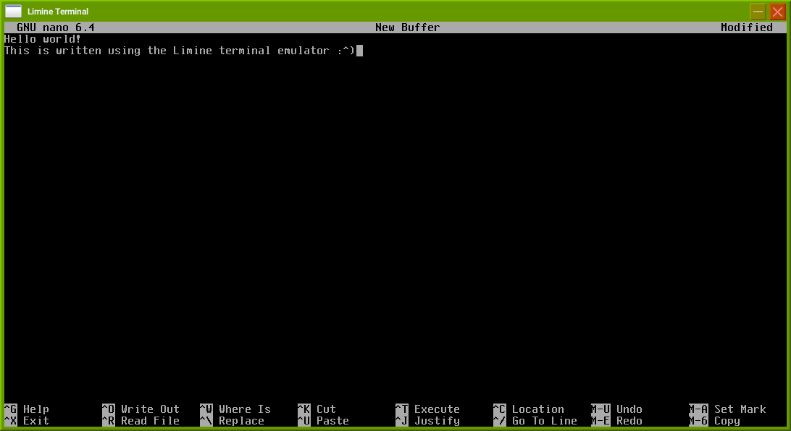
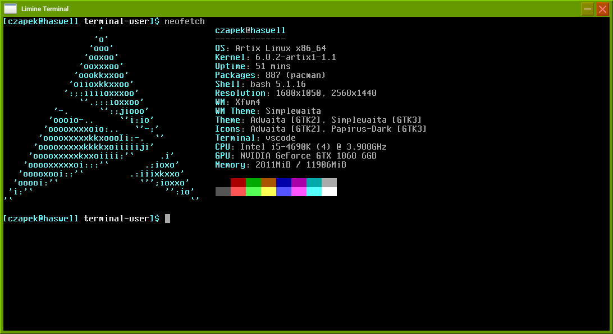
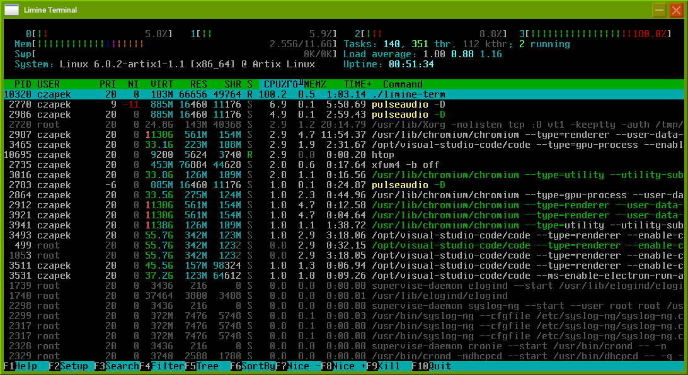

# limine-term-emu

A toy terminal emulator written using SDL and [the standalone Limine terminal](https://github.com/limine-bootloader/terminal).

The goal of this project is to test the capabilities and improve the Limine terminal in real world use cases. The goal of this project
is NOT to build a fully capable terminal emulator or a viable alternative to already existing ones.

Currently it is capable of running most of the popular tools and scripts decently well, like nano, neofetch or htop, though
it still has some minor issues, for example nyancat does not render fully correctly yet. Also the performance of this terminal
emulator is more than questionable, probably because of my lack of knowledge when it comes to userland programming :^)

# Building

To build it you will need SDL2 installed on your system and available through `pkg-config` and `meson` to configure and generate build files.

To configure the project, run `meson build` where build is the build directory name, then if there were no errors you can change to the build
directory and run `ninja` to build the binary. Don't forget to clone the submodules :')

# Screenshots

